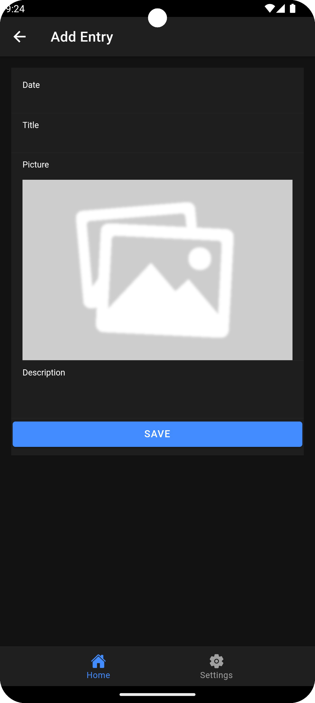

# Daily Moments

This example is part of the Ionic React course.
Here is some the app preview

  
  
  
  

## Links

 * [Ionic Docs](https://ionicframework.com/docs)
 * [Firebase: JavaScript Project Setup](https://firebase.google.com/docs/web/setup)
 * [Firebase: API Reference](https://firebase.google.com/docs/reference/js)
 * [Capacitor Docs](https://capacitorjs.com/docs)
 * [Capacitor Camera Plugin](https://capacitorjs.com/docs/apis/camera)
